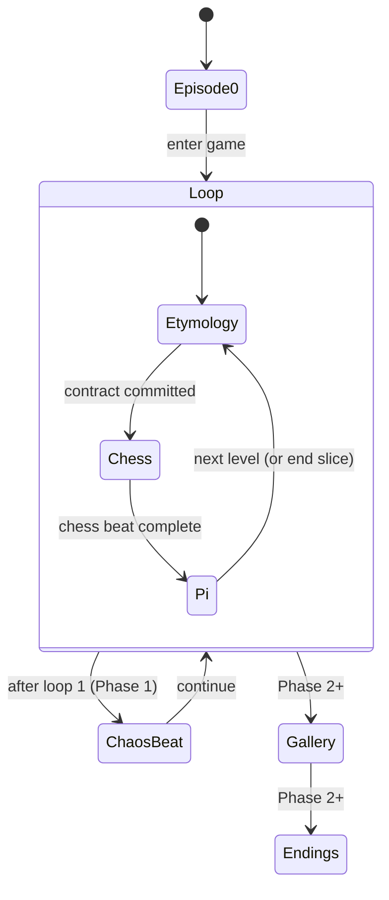

# Still Running — Master PRD (North Star + Pipelines + Story Bible)

Date: 2026-04-21  
Branch context: `etymology-proto-26548`

> This is the **single master requirements document**. It is designed to be readable top-to-bottom, but modular via collapsible sections.
>
> **Raw narrative source**: `capstone/storyboard v1.md` (do not treat as code; treat as the canonical writing scratchpad).  
> **Carroll text archive**: `capstone/docs/blog/THROUGH_THE_LOOKING_GLASS.md` (reference fidelity).

---

## 0) TL;DR

Still Running is a browser game where the player (ecilA) **authors meaning** (Etymology), then meaning contaminates **rules** (Chess), then rules/choices crystallize into **structure** (π graph). The work critiques “optimization” of language: every advance produces interpretation, and every accumulation reduces meaningful difference.

This PRD covers:

- The **full product goal** (Phase 2+ included)
- The **playable vertical slice** (Phase 1)
- All major **pipelines**: Etymology (LLM), Dialogue (RiveScript + LLM fallback), Chess (Stockfish), π Graph (rendering + progression), Persistence (snapshots), Presentation/Livestream Mode, Content authoring
- A **UI redesign pass** (typography + visual layer only): `docs/superpowers/specs/2026-04-21-still-running-ui-redesign-prd.md`

---

## 1) North Star

### 1.1 One Rule (locked)

> **Every advance produces more interpretation, and every accumulation reduces meaningful difference.**

### 1.2 Key phrases — do not change (locked copy)

- `π是无限的，但你不是`
- `heat death of the map not the machine`
- `You're nothing but a pack of tokens`
- `From here, there is no more generated content. Think your own thoughts.`
- `Still Running...`

### 1.3 Non-negotiables (tone + source fidelity)

- **Tonal guardrails**: the critique must be legible in mechanics/copy, not only README text.
- **Source fidelity**: when Humpty/Carroll are quoted or echoed, keep alignment with the archive (`capstone/docs/blog/THROUGH_THE_LOOKING_GLASS.md`).
- **Verbatim lines**: keep locked phrases verbatim wherever they appear.

---

## 2) Product shape (modules + promise)

### 2.1 Modules

- **Etymology (Meaning as contract)**: player authors/chooses definitions that become semantic ground.
- **Chess (Rules as negotiated/broken)**: downstream play reflects contamination from the word contract.
- **π Graph (Structure made visible)**: transitions accumulate; optimization without meaning becomes aesthetic/inevitable.

### 2.2 Master player journey (high-level)

1) **Episode 0**: garden/mirror entry, identity framing, “you are ecilA,” hand customization, mirror flip.
2) **Episodes 1–2**: core loop is learned and repeated, contamination becomes noticeable.
3) **Squares 3–8**: escalation/chaos ramps; the game becomes less “playable” in the conventional sense.
4) **Gallery (llorrac)**: reflection/archive; the run is contextualized as output/production.
5) **Endings**:
   - **Ending A**: acceptance (full version later)
   - **Ending B**: refusal (removal of generated content; quiet; Carroll text)

---

## 3) Scope and releases

### 3.1 Phase 1 (hackathon ~20h) — minimum shippable slice

This is the rebased “Show & Tell” slice:

- **Episode 0** playable end-to-end into the game.
- **One full loop**: Etymology → Chess → π.
- **H.D. basic dialogue** visible.
- **One authored “chaos beat”** after the first loop (signal escalation, do not implement multi-level chaos yet).
- **Presentation (Livestream) Mode** to enable screen recordings of Phase 2 beats using recording-only placeholder screens.

Reference: `docs/superpowers/specs/2026-04-21-still-running-phase-1-prd-design.md`.

### 3.2 Phase 2+ (full product goal)

- Multi-level escalation Squares 3–8 (real mechanics + authored copy).
- Gallery navigation + exhibit content (llorrac).
- Ending A/B implemented with gating and refusal behavior.
- Shared persistent π (if required): decide storage + schema + privacy story, then implement.

---

## 3.3 Presentation script alignment (April 23 demo beats)

The presentation script in `docs/superpowers/specs/insight.md` implies a specific “live demo” shape. This section exists to keep development aligned with what you plan to *say and show*.

**Desired live-demo sequence**

- Define a nonsense word (Etymology).
- Type a frustrated thought into chat (Dialogue): e.g. “This is completely pointless and I want to stop.”
- Pick a definition option (contract commit).
- Make a chess move.
- Observe π graph update.
- Observe the system **echoing your own phrase** (“completely pointless”) in a subsequent authoritative definition (contract contamination).
- (Optionally) claim the chess move is also fed into the next prompt (mechanics-to-text feedback).

**Reality check (current implementation)**

- The Etymology prompt already enforces: playerDefinition phrase must be incorporated verbatim into at least one variant.
- Dialogue chat is currently separate; it does not automatically feed into the Etymology prompt unless explicitly wired.
- Chess moves are recorded in `levelHistory`; they are not currently used as inputs to the Etymology prompt.

**Requirement framing**

- For Phase 1: we can show a version of this demo where the “echo” comes from the **playerDefinition** (already real), and note the chat→prompt + chess→prompt loop as a Phase‑2 requirement.
- For Phase 2+: implement a unified contamination memory object that can include:
  - last chat utterance(s) (player affect)
  - last chess move(s) (player behavior)
  - contract metadata (chosen variant, canonical vs not)

---

## 4) System architecture (conceptual)

### 4.1 State machine (macro)



### 4.2 Where things live (repo map)

<details>
<summary><strong>Click: repo structure relevant to pipelines</strong></summary>

- **App + scenes**
  - `capstone/src/scenes/SceneRouter.tsx` (intro ↔ game)
  - `capstone/src/scenes/GameScene.tsx` (UI glue, dialogue + etymology quiz + router)
  - `capstone/src/components/GameRouter.tsx` (phase router)
- **Etymology**
  - `capstone/src/features/EtymologyEngine/*` (types, API client, patterns, UI)
  - `capstone/server/server.ts` (`POST /api/etymology`, `POST /api/etymology/paraphrase`)
- **Dialogue**
  - `capstone/server/server.ts` (`POST /api/dialogue`, RiveScript + LLM fallback)
  - `capstone/src/components/DialogueBox.tsx` (presentation)
- **Chess**
  - `capstone/src/features/UnlawfulChessboard/*`
  - `capstone/server/server.ts` (Stockfish proxy/analysis endpoints)
- **π graph**
  - `capstone/src/features/PiGraph/*`
- **Persistence**
  - `capstone/src/gameSave/gameStorage.ts` (`capstone.gameSnapshot.v1`)

</details>

---

## 5) Pipelines (end-to-end)

### 5.1 Etymology pipeline (LLM variants + canonical choice)

**Intent**: the player’s authored definition becomes input the system “tokenizes,” then returns multiple meanings; the player chooses one as a contract.

**Flow**

```text
Player definition (client)
  → POST /api/etymology { word, promptConfig, playerDefinition? }
  → server builds Humpty-style prompt (few-shot from patterns)
  → LLM returns JSON array of 3 variants
  → client merges with canonical Carroll option (4th), shuffles, shows quiz
  → confirm commits contract into GameState (levelHistory)
```

**API (current)**

- `POST /api/etymology`
  - Request: `{ word: string, promptConfig?: {...}, playerDefinition?: string }`
  - Response: `{ word: string, variants: EtymologyVariant[3] }`
- `POST /api/etymology/paraphrase`
  - Request: `{ text: string }`
  - Response: `{ text: string }` (Humpty-style rewrite of player definition)

**Contract record (current)**

- Stored in `levelHistory`:
  - `playerDefinition: string`
  - `chosenVariantIndex: number` (0–3)
  - `isCanonical: boolean`

**Failure behavior**

- If the LLM returns malformed JSON, server repairs/parses; client validates `variants.length === 3`.
- If server errors due to missing keys, show actionable error text (already implemented for stale server on port 8787).

### 5.2 Dialogue pipeline (RiveScript + LLM fallback)

**Intent**: H.D. is present as voice/translator. Dialogue should be usable both as:

- (Phase 1) lightweight “Ask H.D.” side channel
- (Phase 2+) a narrative driver (chat loop) that reacts to contract + phase + history

**Flow**

```text
Player message (client)
  → POST /api/dialogue { message, gameState }
  → server tries RiveScript match (dialogue.rive)
  → if no good match: fall back to LLM for response
  → client displays H.D. line in DialogueBox
```

**Design requirement**

- Dialogue responses must not break the locked copy; if a locked phrase is used, it must remain verbatim.

### 5.3 Chess pipeline (UnlawfulChessboard + Stockfish)

**Intent**: rules are negotiated/broken; chess becomes a site where the meaning contract can deform legality/affordances.

**Flow (conceptual)**

```text
Chess UI
  ↔ local chess state (moves, illegal moves allowed by design)
  → optional server analysis (Stockfish) for hints/score/best move
  → snapshot on save/load
```

**Phase 1 requirement**

- A stable chess beat that completes the loop and can be demoed.

**Phase 2+ requirement**

- Define “unlawful” behavior per level and how contract influences it (e.g. allowed illegal move types, hints language, rule constraints).

### 5.4 π graph pipeline (rendering + accumulation)

**Intent**: render structure as inevitable accumulation; it is “optimization without human meaning.”

**Flow**

```text
Level/phase progression
  → π digit transitions accumulate edges (canvas)
  → current edge animates in, then commits to static map
  → optional snapshot for persistence
```

**Phase 2+ requirement**

- Decide how the meaning contract perturbs this structure (color, gating, weights, labels, narration).

### 5.5 Persistence pipeline (save/load)

**Intent**: provide stability for demo + allow a run to be resumed.

**Current**

- Single-slot `localStorage` snapshot `capstone.gameSnapshot.v1`
- Stores: level, phase, levelHistory, plus optional chess/pi snapshots

**Hard rule**

- Presentation Mode preview screens must not write snapshots.

### 5.6 Presentation (Livestream) Mode pipeline

**Intent**: in-app demo control + recording-only placeholders for Phase 2 beats.

**Requirements**

- Hidden toggle (Settings and/or URL query).
- Control panel with:
  - Jumps to playable beats (Episode 0, Level 1, chess, π, chaos beat)
  - Links to placeholder preview screens:
    - Gallery preview
    - Ending A preview
    - Ending B preview (includes verbatim locked phrase)
    - Squares 3–8 escalation montage
    - Shared persistent π preview (“many agents came before you”)

**Preview screen constraints**

- Must be labeled “Preview / Recording-only”.
- Must not mutate GameState or write saves.

---

## 6) Content pipeline (authoring + “script excerpts”)

### 6.1 Source of truth

- **Primary writing scratchpad**: `capstone/storyboard v1.md`
- **Carroll archive**: `capstone/docs/blog/THROUGH_THE_LOOKING_GLASS.md`

### 6.2 How we embed narrative in this PRD

We include **short script excerpts** only (for planning + dev alignment), always pointing back to the raw file.

<details>
<summary><strong>Click: script excerpt — Phase 1 Show & Tell scope (from storyboard)</strong></summary>

```text
In scope:
- Episode 0 — garden, mirror, hand customization, mirror flip
- Episodes 1–2 — core loop working (Etymology → Chess → Pi)
- H.D. basic dialogue
- Red Queen urgency
Out of scope (Part 2):
- llorrac gallery
- Ending A full version
- Ending B
- Surprise escalation Square 3–8
- Shared persistent Pi graph
- Twine build
```

</details>

<details>
<summary><strong>Click: script excerpt — Ending B refusal (Phase 2+; locked line)</strong></summary>

```text
"From here, there is no more generated content."
"Think your own thoughts."
```

</details>

---

## 7) Acceptance criteria (testable)

### 7.1 Phase 1 acceptance (must pass)

- Episode 0 → enter game works reliably.
- One full loop completes (Etymology → Chess → π).
- Etymology step includes: player definition + 3 variants + 1 canonical option + confirm.
- One chaos beat triggers after loop 1 (authored copy + visible nudge).
- Save/load works for playable segments.
- Presentation Mode can navigate to all preview screens; preview screens do not write saves.

### 7.2 Phase 2 acceptance (future)

- Multi-level escalation squares 3–8 implemented (not montage).
- Gallery implemented (not placeholder).
- Ending A + Ending B implemented with gating; refusal removes generated systems.
- Shared persistent π implemented if required, with clear storage/privacy story.

---

## 8) Risks + mitigations

- **RISK: scope creep** (implementing Phase 2 systems in Phase 1)
  - **Mitigation**: placeholder previews + one chaos beat only.
- **RISK: tone drift** (generic “AI game” copy)
  - **Mitigation**: locked phrases + storyboard excerpts + Carroll archive links.
- **RISK: LLM brittleness**
  - **Mitigation**: strict JSON schema, repair parsing, fallbacks, meaningful error messages.

---

## 9) Open questions (intentionally unresolved)

- Contract → chess deformation: what are the concrete, level-specific mechanics?
- Contract → π deformation: what are the concrete, level-specific mechanics?
- Shared π persistence: server vs local-only?
- Ending gates: exact rules and narrative requirements?

---

## 10) Appendix: “phase 2 reminders” checklist

- Multi-level chaos (Squares 3–8) as real gameplay, not montage.
- Gallery (llorrac) as navigable space with content.
- Ending A/B gating + refusal behavior.
- Shared persistent π decision + implementation.
- Locked copy audit across UI, recordings, and docs.

